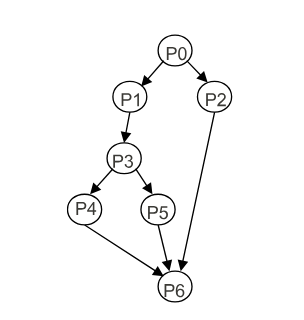
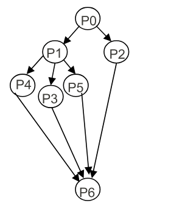
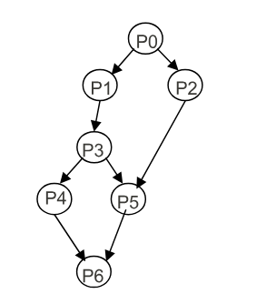
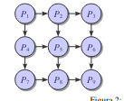

- Autor:
Ismael Sallami Moreno

- Asignatura:
Sistemas Concurrentes y Distribuidos

- Grado: Ingeniería Informática + ADE

- Año:
Tercer Año

-  Tema 1: Relación de Ejercicios : Exclusión Mutua

---

# Ejercicio 1

1. Considerar el siguiente fragmento de programa para 2 procesos P1 y P2  
   Los dos procesos pueden ejecutarse a cualquier velocidad. ¿Cuáles son los posibles valores resultantes para la variable `x`? Suponer que `x` debe ser cargada en un registro para incrementarse y que cada proceso usa un registro diferente para realizar el incremento.

   ```text
   { variables compartidas }

   var x : integer := 0 ;
   Process P1;                     Process P2;
       var i: integer;                     var j: integer;
   begin                           begin
       for i:= 1 to 2 do begin             for i:= 1 to 2 do begin
           x:= x + 1;                              x:= x + 1;
       end                                 end
   end

### Los posibles valores de la variable son: x = 2, 3 y 4

- Cada uno de los dos procesos P1, P2 hace 2 lecturas: L11, L12, L21, L22 y 2 escrituras.
- Cada proceso incrementa (+1) x, 2 veces partiendo de 0: el valor final de x ≠ 2.
- Se hacen 4 incrementos de x: el valor final de x ≠ 4.

| x | P1  | P2  | x | P1  | P2  | x | P1  | P2  |
|---|-----|-----|---|-----|-----|---|-----|-----|
| 0 | L11 | -   | 0 | L11 | -   | 0 | L11 | -   |
| 0 | -   | L21 | 0 | -   | L21 | 1 | E11 | -   |
| 1 | E11 | -   | 1 | -   | L21 | 1 | -   | E21 |
| 1 | -   | E21 | 1 | -   | E21 | 2 | -   | E21 |
| 1 | L12 | -   | 1 | L12 | -   | 2 | L12 | -   |
| 1 | -   | L22 | 2 | E12 | -   | 3 | E12 | -   |
| 2 | E12 | -   | 2 | -   | L22 | 3 | -   | L22 |
| 2 | -   | E22 | 4 | -   | E22 | 4 | -   | E22 |

# Ejercicio 2 
¿Cómo se podría hacer la copia del fichero f en otro g, de forma concurrente, utilizando la instrucción concurrente cobegin-coend? 

Para ello, suponer que:

- Los archivos son una secuencia de ítems de un tipo arbitrario T, y se encuentran ya abiertos para lectura (f) y escritura (g). Para leer un ítem de f se usa la llamada a función `leer(f)` y para saber si se han leído todos los ítems de f, se puede usar la llamada `fin(f)` que devuelve verdadero si ha habido al menos un intento de leer cuando ya no quedan datos. Para escribir un dato x en g se puede usar la llamada a procedimiento `escribir(g,x)`.

- El orden de los ítems escritos en g debe coincidir con el de f.

- Dos accesos a dos archivos distintos pueden solaparse en el tiempo.

### Instrucciones y Código en Concurrente

- Los datos del primer archivo han de ser escritos en el segundo conservando el orden secuencial de aparición.
- La escritura de un elemento procedente del primer archivo puede solaparse en el tiempo con la lectura del siguiente.
- Hay que evitar una condición de carrera en el acceso a la variable compartida que contenga el último dato leído.

```pascal
process Correcto ;
var v_ant, v_sig : T ;
begin
    v_sig := leer(f) ;
    while not fin(f) do begin
        v_ant := v_sig ;
        cobegin 
            escribir(g, v_ant); 
            v_sig := leer(f) ; 
        coend
    end
end
```

# Ejercicio 3

 Construir, utilizando las instrucciones concurrentes cobegin-coend y fork-join, programas concurrentes que se correspondan con los grafos de precedencia que se muestran a continuación:

## a) Grafo de sincronización:

### Grafo



### Bloque de Pseudocódigo 1

```plaintext
begin
P0 ; fork P2 ;
P1 ; P3 ; fork P5 ; P4 ;
join P2 ; join P5 ;
P6 ;
end
```

### Bloque de Pseudocódigo 2

```plaintext
begin
P0 ;
cobegin
    begin
        P1 ; P3 ;
        cobegin P4 ; P5 ; coend
    end
    P2 ;
coend
P6 ;
end
```


## b) Grafo de sincronización:

### Grafo



### Bloque de Pseudocódigo 1

```plaintext
begin
P0 ; fork P2 ;
P1 ; fork P3 ; fork P5 ;
P4
join P2 ; join P3 ; join P5 ;
P6 ;
end
```

### Bloque de Pseudocódigo 2

```plaintext
begin
P0 ;
cobegin
    begin
        P1 ;
        cobegin P3 ; P4 ; P5 ; coend
    end
    P2 ;
coend
P6 ;
end
```


## c) Grafo de sincronización:

### Grafo



### Bloque de Pseudocódigo 1

```plaintext
begin
P0 ; fork P2 ;
P1 ;
P3 ; fork P4 ;
join P2 ;
P5;
join P4 ;
P6 ;
end
```

### Bloque de Pseudocódigo 2

```plaintext
begin
P0 ;
cobegin
    begin P1 ; P3 ; end
    P2 ;
coend
cobegin P4 ; P5 ; coend
P6 ;
end
```

### Bloque de Pseudocódigo 3

```plaintext
begin
P0 ;
cobegin
    cobegin
        begin
            P1 ; P3 ; P4 ;
        end
        P2 ;
    coend
    P5 ;
coend
P5 ; P6 ;
end
```


# Ejercicio 5. 

Suponer un sistema de tiempo real que dispone de un captador de impulsos conectado a un contador de energía eléctrica. La función del sistema consiste en contar el número de impulsos producidos en la hora (cada Kwh consumido se cuenta como un impulso) e imprimir este número en un dispositivo al final de la hora. Para ello se dispone de un programa concurrente con 2 procesos: un proceso acumulador (que cuenta el número de impulsos recibidos) y un proceso escritor (que los imprime en la impresora). En la variable común a los 2 procesos se lleva la cuenta de los impulsos. El proceso acumulador, después de ejecutar la función `Espera_impulso` para esperar a que se produzca un impulso, incrementa la variable. El proceso escritor, después de llamar a `Espera_fin_hora`, hace esperar a que termine una hora. El código de los procesos de este programa podría ser el siguiente:

```plaintext
var contador: compartida;
var n: integer; { contabliliza impulsos }
begin
  while true do begin
    Espera_impulso();
    < n := n+1 >; { (1) }
  end
end

process Escritor;
begin
  while true do begin
    Espera_fin_hora();
    write(n); { (2) }
    < n := 0 >; { (3) }
  end
end
```

En el programa se usan sentencias de acceso a la variable n encerradas entre los símbolos `<` y `>`. Esto significa que cada una de esas sentencias se ejecuta en exclusión mutua entre los dos procesos, es decir, esas sentencias se ejecutan de principio a fin sin entremezclarse entre ellas. Supongamos que en un instante dado el acumulador está esperando un impulso, el escritor está esperando el fin de la hora y la variable n vale `k`. Después se produce un impulso y el escritor se despierta al fin del período de una hora.

Describir lo que puede ocurrir con la intercalación de las instrucciones (1), (2), y (3) a partir de ese momento, indicando cuáles de ellas son correctas y cuáles incorrectas (las incorrectas son aquellas en las que el valor de n no se contabiliza).


### Resolución

- Suponemos una variable ficticia `OUT` que se crea como resultado de la instrucción `write(n)` (2) que contiene el valor impreso (éste pasa así a formar parte del estado).
- En el estado inicial se cumple `n == k`.
- Solo serán correctos los entrelazamientos de instrucciones atómicas del programa que sean compatibles con el estado final: `OUT + n == k + 1`.
- Los posibles entrelazamientos son: (a) 1,2,3, (b) 2,1,3 y (c) 2,3,1.

|       | (a)       |       | (b)       |       | (c)       |       |
|-------|-----------|-------|-----------|-------|-----------|-------|
| inst. | n         | OUT   | inst.     | n     | OUT       | inst. | n         | OUT   |
| -     | k         | -     | -         | k     | -         | -     | k         | -     |
| n:=n+1| k+1       | -     | write(n)  | k     | k         | write(n)| k       | k     |
| write(n)| k+1     | k+1   | n:=n+1    | k+1   | k         | n:=0  | 0         | k     |
| n:=0  | 0         | k+1   | n:=0      | 0     | k+1       | n:=n+1| 1         | k     |


# Ejercicio 7 
Supongamos que tenemos un programa con tres matrices (a, b y c) de valores flotantes declaradas como variables globales. La multiplicación secuencial de a y b (almacenando el resultado en c) se puede hacer mediante un procedimiento MultiplicacionSec declarado como aparece aquí:

```pascal
var a, b, c : array[1..3,1..3] of real ;
procedure MultiplicacionSec()
    var i,j,k : integer ;
    begin
        for i := 1 to 3 do
            for j := 1 to 3 do begin
                c[i,j] := 0 ;
                for k := 1 to 3 do
                    c[i,j] := c[i,j] + a[i,k]*b[k,j] ;
            end
    end
end
```

## Resolución

- Se podría paralelizar calculando de forma independiente las : filas, columnas, ..., de la matriz resultado
- Utilizamos 3 procesos concurrentes `CalcularFila (i:1..3)`:

```pascal
var a, b, c : array [1..3,1..3] of real ;
process CalcularFila[ i : 1..3 ] ;
    var j, k : integer ;
    begin
        for j := 1 to 3 do begin
            c[i,j] := 0 ;
            for k := 1 to 3 do
                c[i,j] := c[i,j] + a[i,k]*b[k,j] ;
        end
    end
end
```
# Ejercicio 8. 

Un trozo de programa ejecuta nueve rutinas o actividades (P1, P2, ..., P9), repetidas veces, de forma concurrente con cobegin-coend (ver trozo de código), pero que requieren sincronizarse según determinado grafo (ver la figura):

```pascal
while true do
  cobegin
    P1 ; P2 ; P3 ;
    P4 ; P5 ; P6 ;
    P7 ; P8 ; P9 ;
  coend
```

## Grafo de sincronización de actividades



## Suposiciones:

- El procedimiento `EsperarPor(i)` es llamado por una rutina cualquiera (la número k) para esperar a que termine la rutina número i, usando espera ocupada. Por tanto, se usa por la rutina k al inicio para esperar la terminación de las otras rutinas que corresponda según el grafo.
- El procedimiento `Acabar(i)` es llamado por la rutina número i, al final de la misma, para indicar que dicha rutina ya ha finalizado.
- Ambos procedimientos pueden acceder a variables globales en memoria compartida.
- Las rutinas se sincronizan única y exclusivamente mediante llamadas a estos procedimientos, siendo la implementación de los mismos completamente transparente para las rutinas.

### Escribe la implementación de `EsperarPor` y `Acabar` (junto con la declaración e inicialización de las variables compartidas necesarias) que cumpla con los requisitos dados.


## Resolución

- Se utilizará un vector de valores lógicos
- Dicho vector ha de inicializarse de una sola vez antes de la siguiente iteración de los bucles
- Solución: al terminar el proceso 9 se inicializará el vector

```pascal
{ compartido entre todas las tareas }
var finalizado : array [1..9] of boolean := (false, ..., false) ;

procedure EsperarPor( i : integer )
begin
  while not finalizado[i] do begin; end
end

procedure Acabar( i : integer )
  var j : integer ;
begin
  if i < 9 then
    finalizado[i] := true ;
  else for j := 1 to 9 do
    finalizado[j] := false ;
end

```

# Ejercicio 10

Obtener la poscondición adecuada para convertir los siguientes fragmentos de código en un triple demostrable con la Lógica de Programas:

#### (a) {i < 10} ; i = 2 * i + 1 ; {}

#### (b) {i > 0} ; i = i - 1; ; {}

#### (c) {i > j} ; i = i + 1; ; j = j + 1 ; {}

#### (d) {falso} ; a = a + 7; ; {}

#### (e) {verdad} ; i = 3; ; j = 2 * i ; {}

#### (f) {verdad} ; c = a + b; ; c = c / 2 ; {}

## Resolución

Se resuelve aplicando directamente el axioma de asignación basado en la sustitución textual de {P} por {P}^x_e en la precondición de los triples:

1. {i < 10} ; i = 2 * i + 1 ; {i < 21} puesto que:
    {i < 21}^i_{2 * i + 1} ≡ {2 * i + 1 < 21} ≡ {i < 10}

2. {i > 0} ; i = i - 1; ; {i > -1}

3. {i > j} ; i = i + 1; ; {i > j + 1} ; j = j + 1 ; {i > j}

4. {F} ; a = a + 7; ; {V}

5. {V} ; i = 3; ; {i = 3} ; j = 2 * i ; {j = 6}

6. {V} ; c = a + b; ; {c = a + b} ; c = c / 2 ; {c = (a + b) / 2}

# Ejercicio 11

¿Cuáles de los siguientes triples no son demostrables con la Lógica de Programas?

#### (a) {i > 0} ; i = i - 1; ; {i >= 0}

#### (b) {x >= 7} ; x = x + 3; ; {x >= 9}

#### (c) {i < 9} ; i = 2 * i + 1; ; {i <= 20}

#### (d) {a > 0} ; a = a - 7; ; {a > -6}

### Resolución

*i, x, a ∈ ℤ*

1. **{i > 0} ; i = i - 1; ; {i + 1 > 0} ⇒ {i >= 0}**

2. **{x >= 7} ; x = x + 3; ; {x >= 10} ⇒ {x >= 9}**

3. **{i < 9} ; i = 2 * i + 1; ; {i < 19} ⇒ {i <= 20}**

4. **{a > 0} ; a = a - 7; ; {a > -7} NOT ⇒ {a > -6}**

### Anotaciones de la resolución 
Por ejemplo, en el caso del apartado 1, calculamos la antigua  **{ i = i + 1}** y la sustituimos en la precondición, asegurándonos de que se cumple.


# Ejercicio 12

Si el triple {P} C {Q} es demostrable, indicar por qué los siguientes triples también lo son (o no se pueden demostrar y por qué):

(a) {P} C {Q ∨ P}

(b) {P ∧ D} C {Q}

(c) {P ∨ D} C {Q}

(d) {P} C {Q ∨ D}

(e) {P} C {Q ∧ P}

## Resolución

El triple {P} C {Q} es demostrable,

1. {P} C {Q ∨ P} también lo es por debilitamiento de la poscondición
2. {P ∧ D} C {Q} también lo es por fortalecimiento de la precondición
3. {P ∨ D} C {Q} No lo es porque se debilita la precondición
4. {P} C {Q ∨ D} lo mismo que (1)
5. {P} C {Q ∧ P} No lo es porque se fortalece la poscondición

# Ejercicio 13

Si el triple {P} C {Q} es demostrable, ¿cuál de los siguientes triples no se puede demostrar?

(a) {P ∧ D} C {Q}

(b) {P ∨ D} C {Q}

(c) {P} C {Q ∨ D}

(d) {P} C {Q ∨ P}

## Resolución

1. {P ∧ D} C {Q}

2. {P ∨ D} C {Q} No se puede demostrar porque se debilita la precondición

3. {P} C {Q ∨ D}

4. {P} C {Q ∨ P}


# Ejercicio 14

Dado el programa `int x = 5, y = 2; cobegin < x = x + y >; < y = x * y > coend;`, obtener:

(a) Valores finales de `x` e `y`

(b) Valores finales de `x` e `y` si quitamos los símbolos `< >` de instrucción atómica.

## Resolución

int x = 5, y = 2; cobegin < x = x + y >;< y = x * y > coend;;

a) Considerando operaciones atómicas (con los símbolos <, >)
  1. {x == 5 ∧ y == 2} < x = x + y >;< y = x * y >
     {x == 7 ∧ y == 14}
  2. {x == 5 ∧ y == 2} < y = x * y >;< x = x + y >
     {x == 15 ∧ y == 10}

b) Sin considerarlas operaciones atómicas (quitando los símbolos <, >)
  1. Los valores de (a) y además {x == 7 ∧ y == 10}


# Ejercicio 15

Comprobar si la demostración del triple `{x ≥ 2} < x = x - 2 > {x ≥ 0}` interfiere con los teoremas siguientes:

(a) `{x ≥ 0} < x = x + 3 > {x ≥ 3}`

(b) `{x ≥ 0} < x = x + 3 > {x ≥ 0}`

(c) `{x ≥ 7} < x = x + 3 > {x ≥ 10}`

(d) `{x ≥ 0} < y = y + 3 > {y ≥ 3}`

(e) `{x es impar} < y = x + 1 > {y es par}`

## Resolución

**Regla no de interferencia de predicado**


$$
\{P\} \text{ con acción atómica } \{P \wedge \text{pre}(a)\} < a > \{P\}
$$


#### Tabla de Interferencias

| Condición inicial | Acción           | Condición final | Interfiere | Justificación                                                                         |
|-------------------|------------------|-----------------|------------|---------------------------------------------------------------------------------------|
| {x ≥ 0}           | `< x = x + 3 >`  | {x ≥ 3}         | Sí         | `{x ≥ 3} < x = x - 2 > {x ≥ 1}`                                                        |
| {x ≥ 0}           | `< x = x + 3 >`  | {x ≥ 0}         | No         | `{x ≥ 2 ∧ x ≥ 0} < x = x - 2 > {x ≥ 0}`                                                |
| {x ≥ 7}           | `< x = x + 3 >`  | {x ≥ 10}        | Sí         | `{x ≥ 7} < x = x - 2 > {x ≥ 5} ⇒ {x ≥ 7}`                                              |
| {y ≥ 0}           | `< y = y + 3 >`  | {y ≥ 3}         | No         | Las variables x e y son disjuntas                                                      |
| {x es impar}      | `< y = x + 1 >`  | {y es par}      | No         | `{x ∈ 2 + 1 ∧ x ≥ 2} < x = x - 2 > {x ∈ 2 + 1} < x + 2 ∈ 2 + 1 > {x ∈ 2 + 1}`      |

### Explicación Detallada del Ejercicio 15

El objetivo del ejercicio es verificar si la demostración del triple de Hoare \(\{x \geq 2\} \; < x = x - 2 > \; \{x \geq 0\}\) **interfiere** con los triples dados. Esto se realiza aplicando la **regla de no interferencia de predicado**: si una acción modifica el estado del programa de forma que el predicado de otro triple no se cumple, entonces existe interferencia.

#### Triple Original
\[
\{x \geq 2\} \; < x = x - 2 > \; \{x \geq 0\}
\]
- **Condición inicial**: \(x \geq 2\)
- **Acción**: \(x := x - 2\)
- **Condición final**: \(x \geq 0\)

### Análisis Fila por Fila

#### 1. **Primera fila**
Triple: \(\{x \geq 0\} \; < x = x + 3 > \; \{x \geq 3\}\)

1. **Condición inicial**: \(x \geq 0\)
2. **Acción**: \(x := x + 3\)
3. **Condición final**: \(x \geq 3\)

- **Interferencia**: **Sí**
- **Justificación**:
  - Si aplicamos \(x := x + 3\), la condición final \(x \geq 3\) se cumple.
  - Pero si después aplicamos \(x := x - 2\), el nuevo valor de \(x\) será \(x - 2\), lo que puede dar como resultado \(x < 3\). Por ejemplo:
    - Si \(x = 2\), después de \(x := x + 3\), tenemos \(x = 5\).
    - Después de \(x := x - 2\), tenemos \(x = 3\), lo cual aún cumple \(x \geq 3\).
    - Pero para valores iniciales más bajos (\(x = 0\)), no se garantiza \(x \geq 3\). Por esto, hay interferencia.

---

#### 2. **Segunda fila**
Triple: \(\{x \geq 0\} \; < x = x + 3 > \; \{x \geq 0\}\)

1. **Condición inicial**: \(x \geq 0\)
2. **Acción**: \(x := x + 3\)
3. **Condición final**: \(x \geq 0\)

- **Interferencia**: **No**
- **Justificación**:
  - La condición inicial (\(x \geq 0\)) no cambia su validez después de \(x := x - 2\).
  - Por ejemplo:
    - Si \(x = 2\), después de \(x := x + 3\), \(x = 5\).
    - Aplicando \(x := x - 2\), \(x = 3\), y aún \(x \geq 0\). La condición final sigue cumpliéndose.

---

#### 3. **Tercera fila**
Triple: \(\{x \geq 7\} \; < x = x + 3 > \; \{x \geq 10\}\)

1. **Condición inicial**: \(x \geq 7\)
2. **Acción**: \(x := x + 3\)
3. **Condición final**: \(x \geq 10\)

- **Interferencia**: **Sí**
- **Justificación**:
  - Si \(x := x + 3\), la condición final \(x \geq 10\) se cumple.
  - Pero al aplicar \(x := x - 2\), el valor de \(x\) disminuye y puede no cumplir \(x \geq 10\).
  - Por ejemplo:
    - Si \(x = 7\), después de \(x := x + 3\), tenemos \(x = 10\).
    - Después de \(x := x - 2\), \(x = 8\), lo cual viola \(x \geq 10\).

---

#### 4. **Cuarta fila**
Triple: \(\{y \geq 0\} \; < y = y + 3 > \; \{y \geq 3\}\)

1. **Condición inicial**: \(y \geq 0\)
2. **Acción**: \(y := y + 3\)
3. **Condición final**: \(y \geq 3\)

- **Interferencia**: **No**
- **Justificación**:
  - La acción modifica la variable \(y\), pero el triple original afecta solo a \(x\).
  - Dado que las variables \(x\) e \(y\) son disjuntas, no hay interferencia.

---

#### 5. **Quinta fila**
Triple: \(\{x \text{ es impar}\} \; < y = x + 1 > \; \{y \text{ es par}\}\)

1. **Condición inicial**: \(x \text{ es impar}\)
2. **Acción**: \(y := x + 1\)
3. **Condición final**: \(y \text{ es par}\)

- **Interferencia**: **No**
- **Justificación**:
  - Aunque \(y\) depende de \(x\), la acción \(x := x - 2\) no afecta la paridad de \(x\).
  - Ejemplo:
    - Si \(x = 3\) (\(x \text{ es impar}\)), entonces \(y := x + 1 = 4\) (\(y \text{ es par}\)).
    - Si aplicamos \(x := x - 2\), \(x = 1\) sigue siendo impar, y \(y = x + 1 = 2\) sigue siendo par.

---

### Resumen Final

| Condición inicial | Acción           | Condición final | Interfiere | Justificación                                                                         |
|-------------------|------------------|-----------------|------------|---------------------------------------------------------------------------------------|
| \(\{x \geq 0\}\)  | \(< x = x + 3 >\) | \(\{x \geq 3\}\) | Sí         | \(x - 2\) puede violar \(x \geq 3\).                                                  |
| \(\{x \geq 0\}\)  | \(< x = x + 3 >\) | \(\{x \geq 0\}\) | No         | \(x - 2\) mantiene \(x \geq 0\).                                                     |
| \(\{x \geq 7\}\)  | \(< x = x + 3 >\) | \(\{x \geq 10\}\) | Sí         | \(x - 2\) puede violar \(x \geq 10\).                                                |
| \(\{y \geq 0\}\)  | \(< y = y + 3 >\) | \(\{y \geq 3\}\) | No         | \(x\) y \(y\) son disjuntos.                                                         |
| \(\{x \text{ es impar}\}\) | \(< y = x + 1 >\) | \(\{y \text{ es par}\}\) | No         | \(x - 2\) no afecta la paridad de \(x\), y por ende tampoco la de \(y\).              |
# Ejercicio 16

Dado el siguiente triple:

```pascal
{x==0}
cobegin
<x=x+a> || <x=x+b> || <x=x+c>
coend
{x==a+b+c}
```

   Demostrarlo utilizando la lógica de asertos para cada una de las tres instrucciones atómicas y después que se llega a la poscondición final `{x==a+b+c}` utilizando para ello la regla de la composición concurrente de instrucciones atómicas.

## Resolución


